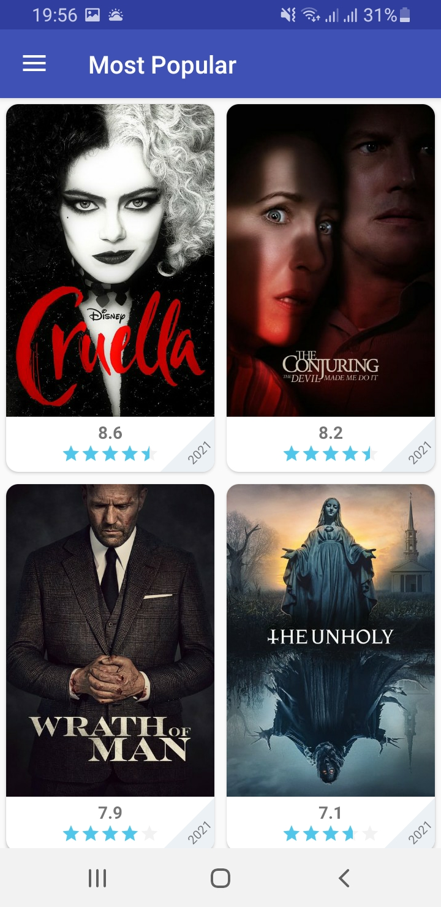
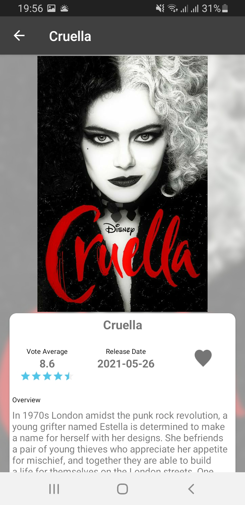
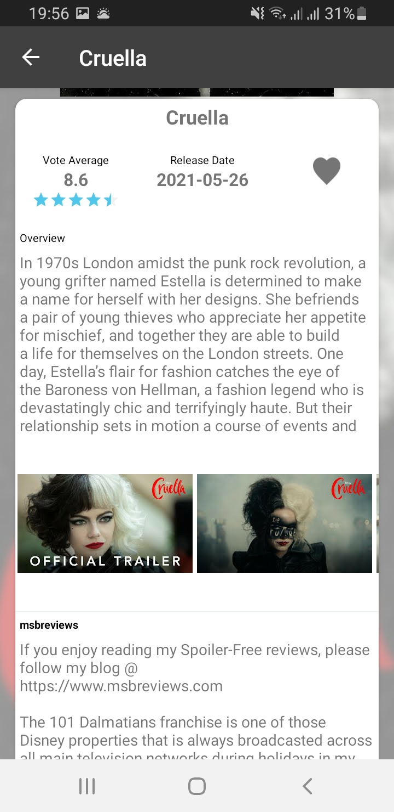
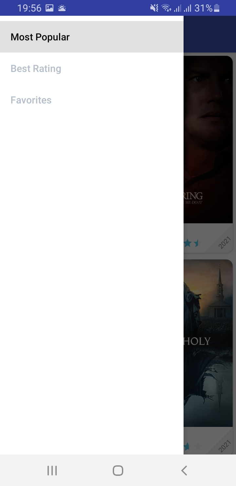
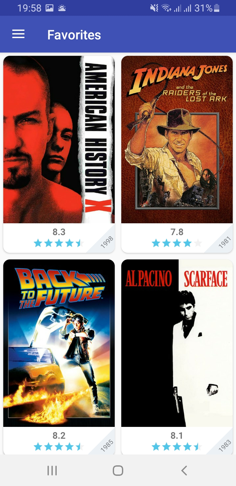
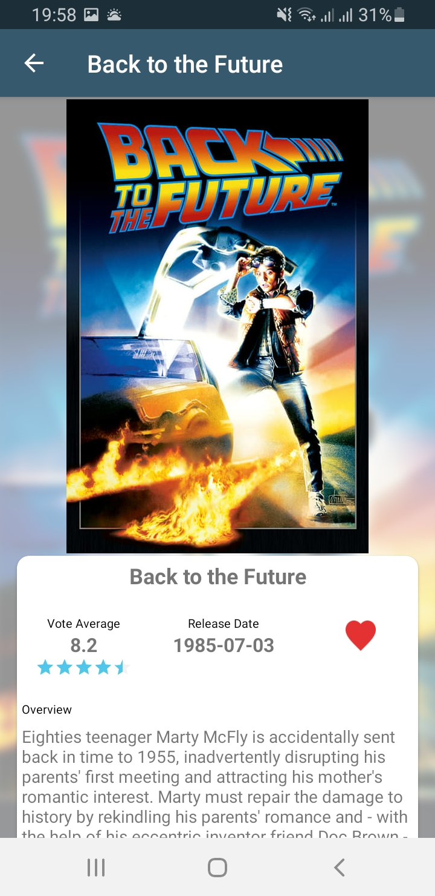

# square

Android application using MVP + Dagger 2 + RX to build a Clean/Modern Android App/Code

App Libraries
In this Project i have used many api which and I will describe each one briefly.

**GLide**: Image Loading and caching library for loading images from internet.  
**ButterKnife**: Dependencies Injection library for views into Android.  
**Retrofit**: HTTP Client Library.  
**RxJava/RxAndroid**: Reactive extension for Java.  
**Palette**:  API for Android that allows you to extract and make use of colors in an image.  
**Shimmer**: Android library that provides an easy way to add a shimmer effect to any view in your Android app.  
**Room Database**: Persistence library provides an abstraction layer over SQLite.     

